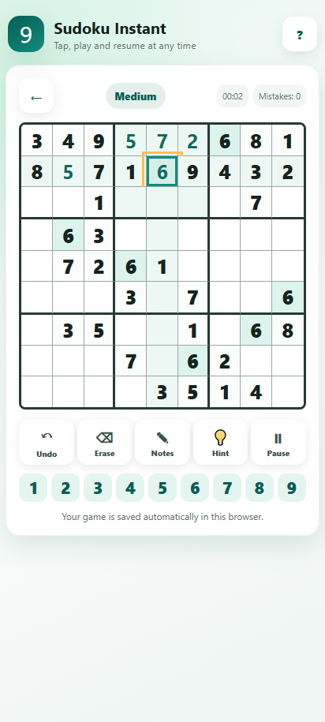
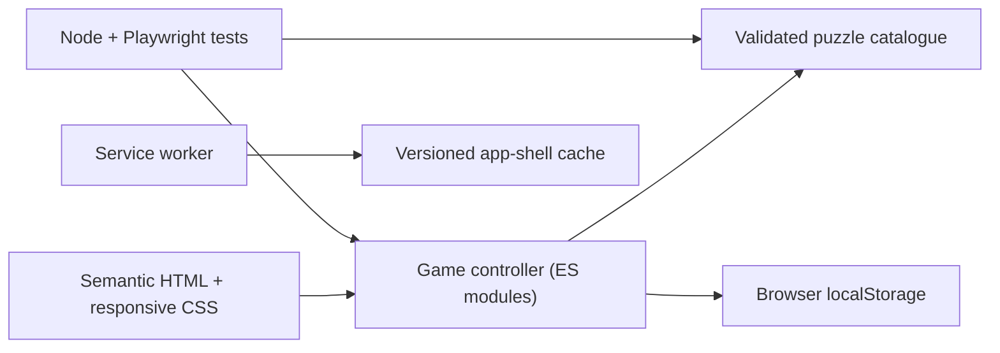

# Sudoku Instant

[](https://github.com/NishikawaButterfly/sudoku-pwa/actions/workflows/ci.yml)

A responsive, accessible Sudoku game you can install as a web app, built with semantic HTML, modern CSS and vanilla JavaScript. Six difficulty levels, candidate notes, hints, undo, keyboard controls, saved progress and offline play. No accounts, no runtime dependencies.

[**Play the live demo**](https://nishikawabutterfly.github.io/sudoku-pwa/)



## Why this project exists

The first version was a standalone HTML file. Some mobile messaging apps opened that file inside a restricted document preview, where JavaScript controls could not run reliably.

This repository turns the game into a Progressive Web App delivered over HTTPS. It opens from a normal link, installs on supported devices and works offline once its app shell has been cached.

## Features

- 24 prevalidated puzzles across six difficulty levels
- Candidate notes, hint, erase, undo and pause
- Timer, mistake counter and a summary when you finish
- Automatic progress saving (saved state is strictly validated before it is restored)
- Sharing through the native Web Share API, with a clipboard fallback
- Full keyboard play: roving focus on the grid, arrow-key navigation, descriptive cell labels

The touch layout works on phones, tablets and desktop browsers. The app installs through a web manifest and keeps an offline cache that is isolated to this app. There are no accounts, no analytics, no ads and no external runtime services.

## Tests

Dependency-free Node tests check the puzzle data: every puzzle, its stored solution and its clue count, plus a bounded solver that confirms all 24 puzzles have exactly one solution. Playwright then plays through the app in desktop Chrome and a Pixel 7 viewport. The regression suite covers persistence, corrupt saved state, notes, pause, mistakes, undo, modal isolation, keyboard navigation and the terminal completion state. GitHub Actions runs everything on each push to `main` and each pull request.

> Difficulty labels are based on clue counts (42 to 25), not on a human-solving-technique rating.

## Architecture



The browser loads a static app shell. `src/app.js` owns game state and presentation; `src/puzzles.js` holds the generated puzzle/solution pairs. Puzzles are precomputed, so generation and uniqueness checks never run in the browser. Progress stays in localStorage behind a strict boundary: malformed or inconsistent data is rejected instead of rendered, and a finished board is terminal, so it cannot be edited or silently saved again.

A few other choices worth mentioning. There is no framework, which keeps the small codebase easy to audit and deploy as static files. The service worker caches only this app's same-origin assets and deletes only older caches under its own prefix, so it cannot touch caches that belong to other apps on the same origin. Local and CI tests use a Node server rather than relying on a system Python command.

## Project structure

```text
sudoku-pwa/
|-- .github/workflows/ci.yml
|-- assets/
|   |-- icons/
|   `-- screenshots/
|-- src/
|   |-- app.js
|   |-- professional.css
|   |-- puzzles.js
|   `-- styles.css
|-- tests/
|   |-- run-e2e.js
|   |-- server.js
|   `-- smoke.spec.js
|-- unit/puzzles.test.js
|-- tools/
|   |-- capture-screenshot.js
|   `-- generate_puzzles.py
|-- index.html
|-- manifest.webmanifest
|-- playwright.config.js
|-- sw.js
`-- README.md
```

## Run locally

Requirements: Node.js 20 or newer.

```bash
npm install
npm run dev
```

Open `http://127.0.0.1:4173`.

## Run the tests

Install the Playwright browser once:

```bash
npx playwright install chromium
```

Then run the data and browser suites:

```bash
npm test
```

Individual commands:

```bash
npm run test:data
npm run test:e2e
```

## Puzzle generation

`tools/generate_puzzles.py` creates solved boards through randomized backtracking, removes clues and checks uniqueness before writing `src/puzzles.js`.

```bash
python tools/generate_puzzles.py --per-level 4 --seed 2026
```

The Node test suite validates the checked-in catalogue again, independently of the generator.

## Privacy and security

Game state stays on your device. The app sends no gameplay data, includes no tracking scripts and never asks for an account. The site is served as plain static files from GitHub Pages. The local test server also prevents path traversal and serves explicit content types.

## Known limitations

- Difficulty is approximated by clue count, not by rated solving techniques.
- Progress lives in one browser profile; there is no sync across devices.
- English only, one visual theme.
- Offline use only kicks in after the first successful online visit.

## Roadmap

Things I might add: dark mode, a daily challenge, privacy-preserving local statistics, translations, automated accessibility audits, and an explicit update prompt when a new service worker is ready.

## License

Released under the [MIT License](LICENSE).
