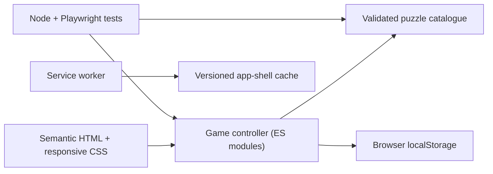

# Sudoku Instant — Progressive Web App

[](https://github.com/NishikawaButterfly/sudoku-pwa/actions/workflows/ci.yml)
[](LICENSE)

A responsive, accessible and installable Sudoku game built with semantic HTML, modern CSS and vanilla JavaScript. It provides six clue-based difficulty levels, local progress saving, candidate notes, hints, undo, keyboard controls and offline support without accounts or runtime dependencies.

[**Play the live demo**](https://jazzy-wisp-f7af77.netlify.app/)


## Why this project exists

The first version was distributed as a standalone HTML file. Some mobile messaging applications opened that file inside a restricted document preview, where JavaScript controls could not run reliably.

This repository turns the game into a Progressive Web App delivered over HTTPS. It can be opened from a normal link, installed on supported devices and used offline after its application shell has been cached.

## Product capabilities

- Six levels and 24 prevalidated puzzles
- Responsive touch layout for phones, tablets and desktop browsers
- Candidate notes, hint, erase, undo and pause controls
- Timer, mistake counter and completion summary
- Automatic local progress persistence with strict saved-state validation
- Native Web Share API with a clipboard fallback
- Roving grid focus, arrow-key navigation and descriptive cell labels
- Installable web app manifest and isolated offline cache
- No accounts, analytics, advertising or external runtime services

## Quality controls

- Dependency-free Node tests validate every puzzle, stored solution and clue count.
- A bounded solver verifies that all 24 puzzles have exactly one solution.
- Playwright runs the product flow in desktop Chrome and a Pixel 7 viewport.
- Regression tests cover persistence, corrupt state, notes, pause, mistakes, undo, modal isolation, keyboard navigation and terminal completion.
- GitHub Actions runs the complete suite for every pull request and push to `main`.

> Difficulty labels are based on clue counts (42 to 25), not on a human-solving-technique rating.

## Architecture



The browser loads a static application shell. `src/app.js` owns game state and presentation, while `src/puzzles.js` contains generated puzzle/solution pairs. Progress stays in the browser. The service worker caches only this application's same-origin assets and deletes only older caches that share its own prefix.

## Important technical decisions

- **Precomputed puzzles:** generation and uniqueness checks stay out of the runtime path.
- **Strict persistence boundary:** malformed or inconsistent browser data is rejected instead of being rendered.
- **Terminal completion state:** a finished board cannot be edited or silently saved again.
- **No framework dependency:** the small product surface remains easy to audit and deploy as static files.
- **Cross-platform test server:** local and CI tests use Node rather than relying on a system Python command.
- **Scoped PWA cache:** the service worker cannot delete caches that belong to other apps on the same origin.

## Project structure

```text
sudoku-pwa/
|-- .github/workflows/ci.yml
|-- assets/
|   |-- icons/
|   `-- screenshots/
|-- src/
|   |-- app.js
|   |-- professional.css
|   |-- puzzles.js
|   `-- styles.css
|-- tests/
|   |-- server.js
|   `-- smoke.spec.js
|-- unit/puzzles.test.js
|-- tools/generate_puzzles.py
|-- index.html
|-- manifest.webmanifest
|-- playwright.config.js
|-- sw.js
`-- README.md
```

## Run locally

Requirements: Node.js 20 or newer.

```bash
npm install
npm run dev
```

Open `http://127.0.0.1:4173`.

## Run the tests

Install the Playwright browser once:

```bash
npx playwright install chromium
```

Then run the data and browser suites:

```bash
npm test
```

Individual commands:

```bash
npm run test:data
npm run test:e2e
```

## Puzzle generation

`tools/generate_puzzles.py` creates solved boards through randomized backtracking, removes clues and checks uniqueness before writing `src/puzzles.js`.

```bash
python tools/generate_puzzles.py --per-level 4 --seed 2026
```

The checked-in catalogue is validated again by the Node test suite, so generation and delivery have independent quality gates.

## Privacy and security

Game state remains on the user's device. The app sends no gameplay data, includes no tracking scripts and requests no account. Netlify headers disable MIME sniffing and unnecessary browser capabilities. The local test server also prevents path traversal and serves explicit content types.

## Known limitations

- Difficulty is approximated by clue count rather than rated solving techniques.
- Progress is local to one browser profile and is not synchronized across devices.
- The initial release has one language (English) and one visual theme.
- Offline use starts only after the first successful online visit.

## Roadmap

- Add automated accessibility audits
- Add optional dark mode
- Add privacy-preserving local statistics
- Add a daily challenge
- Add internationalisation
- Show an explicit update/reload action when a new service worker is ready

## License

Released under the [MIT License](LICENSE).
